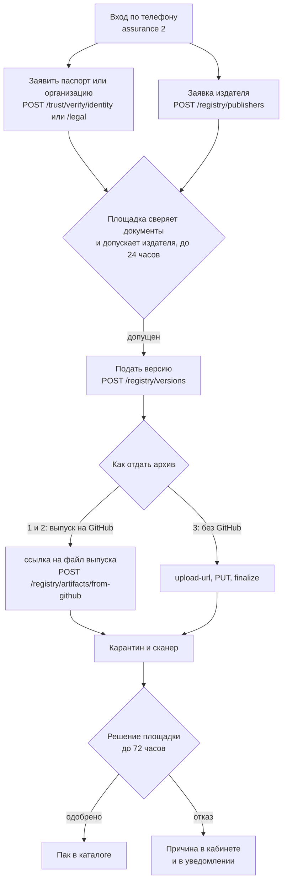

# fixar-packs — паки для площадки ФиксАР

## Что такое ФиксАР

ФиксАР — площадка, на которой люди и практики ведут дела с помощью ИИ-агентов.
Дело — рабочая единица площадки: заведённая по конкретному вопросу (бюджет,
письмо, сделка) папка с участниками, документами и пошаговым планом, который
ведут агенты. На площадке дело заводят, приглашают в него участников,
получают документы и ответы по шагам, вместо того чтобы держать всё в
голове и в переписке. Сторонние разработчики добавляют площадке новые
направления работы и подключения к внешним службам — но не своим кодом
внутри неё: площадка принимает только декларативные описания и исполняет
их сама.

## Для кого

- **Практики** — юристы, риелторы, консультанты и все, кто ведёт несколько
  дел параллельно, а не одно.
- **Их клиенты и семьи** — вторая сторона дела: заказчики услуги, участники,
  которых практик приглашает в своё дело.
- **Разработчики** — публикуют паки и коннекторы: из своего открытого
  репозитория на GitHub, через этот репозиторий или напрямую через API
  площадки.

## Что может разработчик

Манифест объявляет ровно один из трёх видов содержимого, смешивать их нельзя:

- **Пак** — направление: свои сущности дела («объекты»), агенты со своей
  ролью и пределом доверия, шаблоны дел с пошаговым планом — что можно
  делать, в каком порядке и по чьей просьбе.
- **Коннектор** — дверь к внешней службе (MCP/HTTP/webhook). Адрес указывает
  автор, а ключ доступа кладёт сам пользователь площадки при установке —
  «положить можно, прочитать нельзя»: ручки, которая отдавала бы значение
  секрета обратно, не существует.
- **Решение** — сборка минимум из двух уже опубликованных паков и/или
  коннекторов, без собственного содержимого: права и секреты остаются за
  составными частями, а не появляются заново у решения.

Площадка берёт на себя то, чего не должно быть в паке:

- вход и учётные записи;
- ведение дела и его участников;
- обращение к нескольким моделям и оплату кредитами;
- карантин и сканирование каждого поданного архива до всякой проверки
  человеком;
- постепенный выкат новой версии с автоматическим откатом при высокой доле
  отказов;
- публичный каталог;
- телеметрию автору — число вызовов, ошибки, задержки, без данных
  арендаторов, если автор не попросил и не получил отдельное право на
  большее.

Ограничения того же рода: произвольный код разработчика площадка не
исполняет — только объявленное в манифесте. Автор пака лишь **просит** права
(`requested_capabilities`); выдаёт их всегда площадка. Публиковать может
только допущенный издатель — заявленные документы личности или организации
сверяет вручную распорядитель площадки (это отдельная роль от того, кто
сопровождает данный репозиторий на GitHub: слияние PR сюда не равно допуску
издателя площадкой, см. [`CONTRIBUTING.md`](CONTRIBUTING.md)).

## Заработок и монетизация

Кредит — внутренняя единица площадки: 1 кредит = 10 копеек. Ниже — числа из
действующих правил площадки (решения владельца от 13.09.2026 и более ранние),
а не обещание дохода, и статус каждого пункта.

- **Коннектор.** 70% автору с каждого оплаченного вызова, тариф — 1 ₽
  (10 кредитов) за вызов. Тариф действует, и оплаченный вызов начисляет
  автору долю. Оговорка: сегодня коннектор зовут через API площадки — из
  плана дела и из разговора с агентом он ещё не вызывается.
- **Доля с трат клиента.** Из оплаченных кредитов: площадке не менее 20%,
  тому, кто привёл клиента, — 10% на 24 месяца с первой регистрации,
  практику — 70% за его услугу, разработчикам совместно — не более 10% цены
  работы. Сам расчёт построен и проверен, но реально списывает деньги не в
  каждом канале трат — где именно, площадка объявляет отдельно по каждому
  каналу.
- **Подписка на практика.** Действует: оплата только купленными кредитами,
  цену назначает практик, отменить можно в любой момент. Это первый канал,
  где доля с трат клиента по-настоящему списывает деньги — но доля
  разработчиков паков внутри этой подписки пока не заведена вовсе.
- **Партнёрский контур.** Комиссию площадки от внешних партнёрских программ
  площадка делит: держателю (практику) 50%, паку — 30%, от комиссии площадки,
  не от суммы продажи. Действует.
- **Комиссия интегратору** за подключение стороннего магазина — решено
  владельцем, но не построено: расчёта такой комиссии в коде пока нет.
- **Оплата принятого вклада разработчика** (тестовые сессии, паки, доработки
  ядра) — только после явной приёмки владельцем; начисляется отдельно от
  выручки по вызовам, прайс публикуется заранее и не меняется задним числом.

**Важно.** Всё перечисленное начисляется в кредиты. Вывод накопленного
кредитами на банковский счёт ещё не запущен — площадка ждёт открытия
номинального счёта. Приведённые числа — действующие правила площадки, а не
обещание и не гарантия дохода.

## Как начать

1. Изучите формат пака — [`docs/format.md`](docs/format.md) — рядом с
   минимальным рабочим примером
   [`packs/example/letter-triage/`](packs/example/letter-triage/).
2. Посмотрите более длинный пример с честно отмеченными недостроенными
   частями — [`packs/example/family-budget/`](packs/example/family-budget/):
   что в нём уже работает, а что прямо названо не сделанным, описано в README
   самого примера.
3. Проверьте свой пак локально инструментом `tools/pack.py` (см. ниже).
4. Подайте. Основной путь — ссылкой на выпуск в своём открытом репозитории
   на GitHub; второй — PR в этот репозиторий; третий — целиком через API.
   Все три — в разделе [«Пути подачи»](#пути-подачи).

---

## Устройство репозитория

```
packs/<namespace>/<name>/
  pack.yaml               # манифест — обязателен
  <domain>.yaml            # файл направления, если объявлены domains
  tests/                   # обязателен — фикстуры
  evals/                   # обязателен — оценки
tools/
  pack.py                  # check / build / tag / validate — см. ниже
.github/
  workflows/check.yml      # проверка PR и main: check, build дважды, validate
  workflows/release.yml    # по метке собирает и публикует выпуск
```

Правила самого манифеста и архива — в [`docs/format.md`](docs/format.md). Как
добавить пак прямо в этот репозиторий через PR — в
[`CONTRIBUTING.md`](CONTRIBUTING.md).

## Инструмент автора: `tools/pack.py`

Python 3.10+ и PyYAML (`pip install pyyaml`). Без PyYAML инструмент
отказывает, а не пропускает проверку: пропущенная сверка выглядела бы
пройденной.

```bash
python3 tools/pack.py check packs/<ns>/<name>          # локальные проверки без сети
python3 tools/pack.py build packs/<ns>/<name> --out dist  # детерминированный tar.gz
python3 tools/pack.py tag packs/<ns>/<name>             # метка выпуска по схеме
python3 tools/pack.py validate packs/<ns>/<name>        # проверка манифеста площадкой, без подачи
```

`check` ничего не отправляет и работает без сети. `validate` — единственная
команда, которая обращается к сети: она шлёт `pack.yaml` в `POST
/registry/validate` той же схемой, что и подача версии, но ничего не подаёт и
не занимает — удобно гонять в CI на каждый коммит.

## Пути подачи

Проверка на площадке одна и та же при любом пути: вход и заявка издателя,
сверка документов, карантин и сканер архива, решение площадки. Пути
отличаются только тем, где лежит пак и как площадка получает архив.

1. **Основной — свой открытый репозиторий на GitHub.** Пак живёт у вас.
   Скопируйте к себе `tools/pack.py` и `.github/workflows/release.yml`,
   ставьте метку — выпуск соберётся сам. Ссылку на файл выпуска и его
   sha256 отдайте в кабинете автора или одним вызовом
   `POST /registry/artifacts/from-github`. От сопровождающих этого
   репозитория вам ничего не нужно. Подробности:
   [`docs/podacha-ssylkoy.md`](docs/podacha-ssylkoy.md).
2. **Второй — PR в этот репозиторий.** Для примеров, которые площадка
   показывает от своего имени, и для тех, кто не хочет вести свой
   репозиторий. Сливают и ставят метку сопровождающие, поэтому путь медленнее
   и зависит от них. Правила: [`CONTRIBUTING.md`](CONTRIBUTING.md).
3. **Без GitHub — целиком через API.** Манифест и архив загружаются через
   `api.agrigate.pro`. Подробности с примерами `curl`:
   [`docs/podacha-api.md`](docs/podacha-api.md).



## Что происходит с паком после подачи

1. **Карантин и сканер.** Архив сначала лежит в карантинной корзине. Сканер
   разбирает его без исполнения — проверяет состав, находит секреты и
   попытки перехвата указания модели, если они есть, — результат виден
   автору в его кабинете.
2. **Сверка документов.** Отдельно от конкретной версии, ещё на этапе допуска
   издателя, распорядитель площадки вручную сверяет заявленные документы
   личности или юридического лица. Без этого заявка издателя остаётся
   нерассмотренной, и новые версии подавать нельзя.
3. **Решение.** Площадка одобряет или отклоняет версию. Одобрят только ту, у
   которой архив прошёл сканер и был продвинут площадкой.
4. **Каталог.** Одобренная версия появляется в общем каталоге. Сама она
   никому не ставится: пак подключают те, кто решил им пользоваться. Кнопки
   «поставить пак» в оболочке пока нет — поставить можно через API
   (`POST /registry/install`) или попросить площадку. Разбор на живом
   примере — раздел 2, шаг 1, в
   [`packs/example/family-budget/README.md`](packs/example/family-budget/README.md).

Отдельного шага «проверка развёртыванием» для декларативного пака не бывает:
пак не содержит кода, который можно запустить, — есть только манифест и файл
направления, и их проверяют разбором, а не запуском.

### Где узнать решение

- **Кабинет автора** — `https://agrigate.pro/pak/kabinet/`: состояние каждой
  версии, записка при отказе или снятии, срок разбора, а для архива — совпал
  ли отпечаток и что нашёл сканер.
- **Ящик уведомлений** — `GET /principals/{principal_id}/notifications`:
  решения приходят как уведомления видов `pack.publisher` (по заявке
  издателя) и `pack.version` (по версии пака).
- **История своих версий** — `GET /registry/publishers/{principal_id}/versions`:
  все свои версии разом, с состоянием и состоянием архива.

## Лицензия

Инструменты и документы этого репозитория — MIT, см. [`LICENSE`](LICENSE).
Это не лицензия самих паков: у каждого пака своя лицензия, указанная в его
`pack.yaml` (`metadata.license`), и она может отличаться от MIT.
