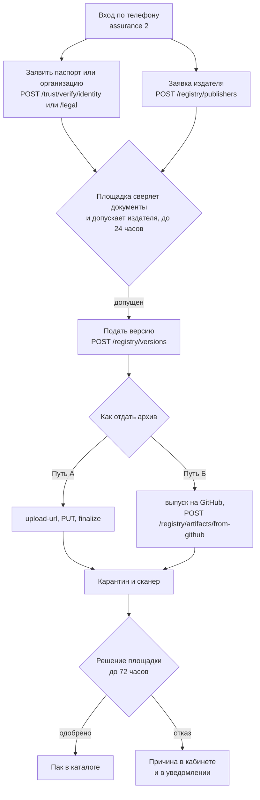

# fixar-packs

Открытый репозиторий паков для площадки [ФиксАР](https://agrigate.pro). Пак —
это декларативное описание направления (агенты, шаблоны дел, источники,
коннекторы к внешним службам) в формате YAML. Кода внутри пака не бывает:
площадка принимает только объявления, а исполняет их сама.

Здесь лежат:

- готовые паки для площадки (`packs/`);
- инструмент автора для локальной проверки и сборки (`tools/`);
- рабочий процесс GitHub Actions, который собирает и публикует выпуск после
  слияния (`.github/`).

Публичная дверь площадки: `https://api.agrigate.pro`. Кабинет автора (веб):
`https://agrigate.pro/pak/kabinet/` — там можно сделать всё то же, что через
API, без командной строки.

## Устройство репозитория

```
packs/<namespace>/<name>/
  pack.yaml               # манифест — обязателен
  <domain>.yaml            # файл направления, если объявлены domains
  tests/                   # обязателен — фикстуры
  evals/                   # обязателен — оценки
tools/
  pack.py                  # check / build / tag / validate — см. ниже
.github/
  workflows/check.yml      # проверка каждого PR: check/build дважды/validate
  workflows/release.yml    # собирает и публикует выпуск после слияния/тега
```

Пример рабочего пака со всеми обязательными частями:
[`packs/example/letter-triage/`](packs/example/letter-triage/) — подробный
разбор его манифеста и файла направления — в
[`docs/format.md`](docs/format.md).

## Инструмент автора: `tools/pack.py`

Python 3.10+ и PyYAML (`pip install pyyaml`). Без PyYAML инструмент
отказывает, а не пропускает проверку: пропущенная сверка выглядела бы
пройденной.

```bash
python3 tools/pack.py check packs/<ns>/<name>          # локальные проверки без сети
python3 tools/pack.py build packs/<ns>/<name> --out dist  # детерминированный tar.gz
python3 tools/pack.py tag packs/<ns>/<name>             # метка выпуска по схеме
python3 tools/pack.py validate packs/<ns>/<name>        # проверка манифеста площадкой, без подачи
```

`check` ничего не отправляет и работает без сети: расширения файлов, пределы
размеров, отсутствие ссылок и симлинков, наличие `tests/` и `evals/`,
совпадение namespace/name/version с путём. `validate` — единственная команда,
которая обращается к сети: она шлёт `pack.yaml` в `POST
/registry/validate` той же схемой, что и подача версии, но ничего не подаёт и
не занимает — удобно гонять в CI на каждый коммит.

## Два пути подачи

Дальше — про то, как готовый пак попадает на площадку. У обоих путей общее
начало (вход, повышение доверия, заявка издателя) и общий конец (карантин,
сканер, решение); отличается только то, как площадка получает сам архив.



- **Путь А — целиком через API площадки.** Манифест и байты архива идут через
  `api.agrigate.pro`. Подробности с примерами `curl`: [`docs/podacha-api.md`](docs/podacha-api.md).
- **Путь Б — архив забирается по ссылке.** Пак публикуется как выпуск
  (release) на GitHub — в этом репозитории через PR или в собственном
  открытом репозитории автора — а площадка сама забирает файл выпуска по
  ссылке одним вызовом. Подробности: [`docs/podacha-ssylkoy.md`](docs/podacha-ssylkoy.md).

Оба пути требуют одного и того же: пройти вход и повышение доверия, заявить
документы, дождаться заявки издателя и подать версию манифеста. Разница только
в шаге «отдать байты архива».

Правила самого манифеста и архива — отдельно, в [`docs/format.md`](docs/format.md).
Как добавить пак прямо в этот репозиторий через PR — в [`CONTRIBUTING.md`](CONTRIBUTING.md).

## Что происходит с паком после подачи

1. **Карантин и сканер.** Загруженный (или забранный по ссылке) архив сначала
   лежит в карантинной корзине. Сканер разбирает его без исполнения —
   проверяет состав, находит секреты и попытки перехвата указания модели,
   если они есть, — и результат виден автору в его же кабинете.
2. **Сверка документов.** Отдельно от конкретной версии пака, ещё на этапе
   допуска издателя, площадка (её распорядитель) вручную сверяет заявленные
   автором документы личности или юридического лица с настоящими. Без этого
   заявка издателя остаётся нерассмотренной, и новые версии подавать нельзя.
3. **Решение.** Площадка одобряет или отклоняет версию. Одобрят только ту, у
   которой архив прошёл сканер и был продвинут площадкой — валидный манифест
   без загруженного архива никогда не станет одобренным сам по себе.
4. **Каталог.** Одобренная версия появляется в общем каталоге площадки. Пак
   в каталог не «раскатывается» автоматически никому: каждый арендатор
   устанавливает его себе сам, когда решит, что он ему нужен.

Отдельного шага «проверка развёртыванием» для декларативного пака не бывает:
пак не содержит кода, который можно запустить, — есть только манифест и файл
направления, и их проверяют разбором, а не запуском.

### Где узнать решение

- **Кабинет автора** — `https://agrigate.pro/pak/kabinet/`: видно состояние
  каждой версии, записку при отказе или снятии, срок разбора, а для архива —
  совпал ли отпечаток и что нашёл сканер.
- **Ящик уведомлений** — `GET /principals/{principal_id}/notifications`:
  решения приходят как уведомления видов `pack.publisher` (по заявке
  издателя) и `pack.version` (по версии пака).
- **История своих версий** — `GET /registry/publishers/{principal_id}/versions`:
  все свои версии разом, с состоянием и состоянием архива.

## Лицензия

Инструменты и документы этого репозитория — MIT, см. [`LICENSE`](LICENSE).
Это не лицензия самих паков: у каждого пака своя лицензия, указанная в его
`pack.yaml` (`metadata.license`), и она может отличаться от MIT.
