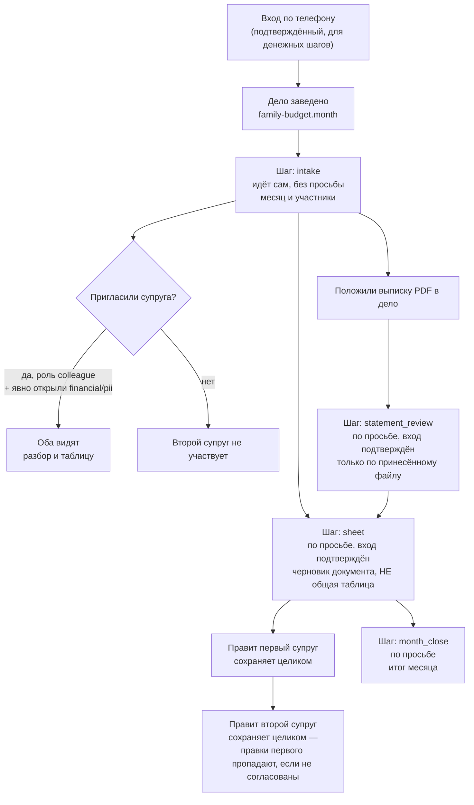

# example/family-budget — бюджет семьи вдвоём

Пример пака для площадки ФиксАР. Двое ведут один бюджет в одном деле:
выписку банка кладут в дело сами, файлом PDF, агент сводит таблицу бюджета
черновиком документа, оба смотрят и правят дальше. Общей живой таблицы,
приёма выписки письмом и самостоятельного чтения счёта в банке у площадки
сегодня нет — это описание разворачивает пайплайн пака целиком: что
получает семья, что делает автор при публикации и чего площадке пока не
хватает, чтобы закрыть оставшиеся пункты.

## 1. Что работает сегодня и что не построено

| Умение | Статус | Если статус «не построено» — что делаете вы |
|---|---|---|
| Собрать таблицу бюджета на месяц (`budget_sheet`) | Работает | — |
| Разобрать выписку, которую вы положили в дело (`statement_review`) | Работает | — |
| Вести одну таблицу, которую правят оба одновременно (`shared_sheet`) | Не построено | Правьте черновик по очереди: сохранение записывает правку целиком поверх прежней (см. раздел 2) |
| Получать выписку письмом на адрес дела (`bank_statement_by_mail`) | Не построено | Выгружаете выписку в приложении банка сами и добавляете файл в дело |
| Забирать выписку из банка самостоятельно (`bank_pull`) | Не построено | У банков нет входа для стороннего сервиса к операциям личного счёта — выписку всегда приносите вы (см. раздел 5) |
| Пригласить супруга ролью «супруг» с готовым доступом сразу (`spouse_invite_role`) | Не построено | Второго добавляют обычным участником; видимость «финансовое» (и «личное» для разбора выписки) включаете отдельным действием при приглашении или сразу после |

Все шесть строк — объявленные умения направления (`platform_abilities` в
`family-budget.yaml`), а не оценка на словах: у построенных `mode:
own_corpus`, у не построенных — `mode: not_built` с тем же текстом, что и в
этой таблице.

**Статус этого примера.** Текст ниже описывает, как выглядело бы дело, если
бы эта версия пака была опубликована и установлена на площадке у
конкретного арендатора. Сам пример в этом репозитории — заготовка под
публикацию под собственными `namespace`/`publisher` издателя (см. раздел
3), а не уже установленное на живой площадке направление: читайте разделы
1–2 как «как это будет выглядеть после установки», а не как «войдите и
попробуйте прямо сейчас».

**Кому какой раздел.** Разделы 1–2 — как это выглядит для семьи, которая
ведёт бюджет. Раздел 3 — как этот же пак публикует автор. Разделы 4–5 —
план площадки и разбор законодательства, если интересно техническое и
юридическое обоснование того, чего сегодня нет.

## 2. Для семьи: как идёт дело о бюджете

**Шаг 0 — вход по телефону.** Разбор выписки, таблица и итог месяца
касаются денег и личных сведений, поэтому эти шаги работают только после
подтверждённого входа (`min_assurance: 2`). Для шага с таблицей этого требует
сама площадка: любой шаг, который заводит черновик документа, обязан быть по
просьбе и с подтверждённым входом. Для разбора выписки и итога месяца тот же
порог поставил автор пака — по правилу площадки «кто видит денежные сведения,
отвечает только после подтверждённого входа». Без входа с вами поговорит
агент `talk`: расскажет, что умеет дело, и предложит завести его, но сумм,
остатков и номеров счетов не спросит и не покажет.

**Шаг 1 — пак должен быть у вас поставлен.** Это делает площадка после
того, как версия пака прошла путь из раздела 3 (проверка → приём →
каталог). Пока пак не поставлен в вашем личном кабинете, направление
«Бюджет семьи вдвоём» в перечне направлений не появится. Кнопки «поставить
пак» в оболочке сегодня нет: поставить можно через API площадки
(`POST /registry/install`) или попросив площадку. Формы для такой просьбы
пока тоже нет — это недостроенный кусок площадки, а не забытая строка в
этом README. После установки направление ведёт себя как любое штатное:
выбираете его и заводите дело.

**Шаг 2 — заводите дело «Бюджет семьи на месяц».** Дело заводится одним
нажатием. Первый шаг лестницы («Собрать, кто ведёт бюджет и на какой
месяц») идёт сам, без вашей просьбы: спрашивает месяц и участников — это
шаг с обычными сведениями, вход ему не нужен.

**Шаг 3 — приглашаете супруга и открываете ему «финансовое».** Второго
добавляют в то же дело обычным участником — это работает. Но по умолчанию
новый участник видит только обычные материалы; ни разбор выписки, ни
таблицу он не увидит, пока вы явно не включите ему видимость «финансовое»
(а для разбора выписки — ещё и «личное», потому что в ней кроме сумм есть
названия мест и даты). Форма приглашения даёт включить нужные рода сведений
сразу при отправке приглашения — можно и отдельно, позже, через правку
состава участников. Надписи «супруг» у участника при этом не появится (см.
раздел 1) — это не мешает работе, но название роли на экране искать не
нужно.

**Шаг 4 — скачиваете выписку в приложении банка и кладёте файл в дело.**
Площадка не читает счёт за вас — вы выгружаете выписку сами. В приложении
Т-Банка: «Главная» → имя → «Справки» (для разовой справки на почту, готова
за ~10 минут) или карта → «Детали счёта» → «Выписка по счёту» (для
выписки по счёту, PDF). Полученный файл добавляете материалом в дело, как
любой другой документ.

**Шаг 5 — просите разобрать выписку.** По просьбе, с подтверждённым
входом, шаг «Разобрать выписку, которую вы положили в дело» проходит по
тексту принесённого файла: куда уходит больше всего, что повторяется, что
выбивается из обычного месяца. Чего в выписке не было, агент не досчитывает
и не предполагает.

**Шаг 6 — просите собрать таблицу.** Хранитель сводит статьи, доходы и
остаток в черновик документа — не в общую таблицу с одновременной правкой
(такой у площадки нет, см. раздел 1). Черновик забирают себе оба.

**Как правит второй супруг.** Черновик документа открывается отдельной
вкладкой у того, кто его открыл; правка сохраняется одной кнопкой целиком
поверх прежнего текста, а не построчной синхронизацией. Если откроете и
будете править черновик одновременно, доедет только правка того, кто
сохранил последним, — правки другого пропадут молча. Договоритесь заранее,
кто в какой момент правит, или правьте по очереди, забирая свежую копию
после правки другого.

**Шаг 7 — подводите итог месяца.** По просьбе шаг «Подвести итог месяца»
называет, куда уходили деньги за месяц и сколько осталось от заложенного.



**Про пересечение границы и банковскую тайну.** Выписку в дело кладёте вы
сами и добровольно — это не то же самое, что банк отдаёт ваши операции
стороннему сервису по обходу вас: с точки зрения банковской тайны решение
показать свою же выписку остаётся вашим. Дальше разбор этой выписки ведёт
хранитель бюджета через модель, которая физически работает за пределами
площадки, — то есть на этом шаге содержимое выписки (суммы, места, даты)
покидает периметр площадки. Вопрос о трансграничной передаче площадка
задаёт не на всех входных путях одинаково: если вы вошли через кабинет на
сайте, вопрос показывается; для входа через некоторые другие каналы
(мессенджеры, программный доступ) на сегодня он может не показаться вовсе.
Это ограничение самой площадки, а не то, что может сузить один пак, — но
знать о нём стоит до того, как класть выписку в дело, а не после.

## 3. Для автора пака: как публикуется этот же пак

Локальная проверка перед подачей — тот же набор команд, что у любого пака
в этом репозитории:

```bash
python3 tools/pack.py check packs/example/family-budget
python3 tools/pack.py build packs/example/family-budget --out dist
python3 tools/pack.py validate packs/example/family-budget
```

Дальше — публикация. Манифест подаётся в API одинаково независимо от
выбранного пути (вход → подтверждение личности → заявка издателя → допуск
→ подача версии); отличается только то, откуда площадка получает архив:
основной путь — собственный открытый репозиторий автора на GitHub, второй
путь — PR в `fixar-packs` (для примеров площадки и тех, кто не хочет вести
свой репозиторий).

```mermaid
graph LR
  A["tools/pack.py check"] --> B["tools/pack.py build<br/>детерминированный sha256"]
  B --> C["tools/pack.py validate"]
  C --> D1["Основной путь:<br/>свой репозиторий на GitHub"]
  C --> D2["Второй путь:<br/>PR в этот репозиторий"]
  D1 --> E1["Тег + release.yml<br/>публикует выпуск сам автор"]
  D2 --> E2["Проверка Actions<br/>(check + build в CI)"]
  E2 --> F["Слияние PR<br/>сопровождающим"]
  F --> G["Метка выпуска<br/>ставит сопровождающий"]
  G --> H["release.yml собирает архив<br/>и публикует файлом выпуска"]
  E1 --> I["Заявка издателя +<br/>сверка документов площадкой"]
  H --> I
  I --> J["Подача версии<br/>pack.yaml"]
  J --> K["Ссылка на выпуск + sha256<br/>→ площадка сама скачивает архив"]
  K --> L["Карантин и сканер<br/>(секреты, перехват подсказки, пути)"]
  L --> M["Решение площадки<br/>(до 72 часов)"]
  M --> N["Каталог"]
  N --> O["Установка у арендатора"]
```



Основной путь — пак живёт в собственном репозитории автора: тот же архив и
та же метка публикуются его собственным выпуском GitHub, площадка забирает
файл по ссылке на публичный (не черновой) релиз и сверяет отпечаток
(`sha256`) до того, как передать содержимое сканеру. Второй путь — метку
выпуска и сам релиз в этом репозитории ставит сопровождающий после слияния
PR, не автор пака (правила приёма — в `CONTRIBUTING.md`); годится для
примеров площадки и тех, кто не хочет вести свой репозиторий.

Заявку издателя, заявление документов личности и саму подачу версии можно
провести и без единого `curl` — через кабинет автора на
`https://agrigate.pro/pak/kabinet/`, который вызывает те же ручки, что и
прямой API. Подробный шаг за шагом с точными телами запросов — в
[`docs/podacha-api.md`](../../../docs/podacha-api.md) (путь целиком через
API) и [`docs/podacha-ssylkoy.md`](../../../docs/podacha-ssylkoy.md) (путь
через ссылку на выпуск GitHub); они не повторяются здесь построчно.

Перед публикацией своей версии этого пака замените `metadata.namespace` и
`metadata.publisher` в `pack.yaml` на свои — оба закрепляются за изданием
навсегда.

## 4. План достройки площадки (решение владельца)

Ничего из перечисленного не чинится правкой самого пака — нужна работа
площадки. Пункты решения владельца:

**Приём выписки письмом, с проверкой подписи банка.** Свой почтовый адрес
у дела и проверка, что письмо действительно пришло от `tbank.ru` или
`tinkoff.ru` (у обоих доменов настроена подпись почты SPF+DKIM с жёсткой
политикой DMARC — `p=reject`, письма от чужого имени такую проверку не
проходят), а не подделка. Семье это даст: разовую справку с выпиской, которую
банк присылает на почту за ~10 минут по запросу (подтверждено и для личного
счёта, и для счёта ИП/юрлица), площадка забирала бы из своего почтового
ящика и сама клала бы в дело — без ручной выгрузки и переноса файла каждый
раз. Регулярную рассылку выписки по расписанию банк официально предлагает
только для счёта ИП/юрлица (настраиваемый «шаблон»); для личного счёта
частного лица такой настраиваемой периодичности в открытой документации
банка не нашлось — расчёт именно на разовый запрос по почте, а не на
автоматическую регулярную рассылку. Умение `bank_statement_by_mail`
перейдёт из `not_built` в `built`; версия пака поднимется минимум до
`1.1.0`.

**Кнопка «Добавить выписку» и разбор PDF/XLSX в отдельные операции.**
Сегодня хранитель разбирает текст выписки целиком и отвечает связным
текстом; таблица собирается отдельным черновиком документа. С этим
пунктом файл выписки превращался бы сразу в список отдельных операций
(дата, сумма, статья) внутри дела — семье это даст возможность посмотреть
и отфильтровать операции по отдельности, а не только читать сводный ответ
и черновик. Требует разбора табличных форматов (включая XLSX — самый частый
формат банковских выгрузок), которого у площадки сегодня нет ни для одного
направления.

**Совместная живая таблица.** Документ, который оба супруга видят и правят
одновременно, с показом правок другого без выхода и повторного открытия —
такого механизма нет ни в одном направлении площадки, не только в этом
паке. Закрывает главную неудобность раздела 2: сегодня правка сохраняется
целиком поверх прежней, и супругам приходится договариваться, кто правит
когда. Умение `shared_sheet` перейдёт в `built`.

**Напоминание по расписанию.** Регулярное напоминание — например, раз в
месяц — положить новую выписку и подвести итог, без того чтобы кто-то из
супругов вспоминал об этом сам. Требует повторяющихся событий (не разовых)
в календаре дела, которых сегодня нет ни у одного направления.

Сроков по этим пунктам не называем — они в плане владельца площадки, а не
в обязательствах этого пака.

## 5. Почему в паке нет подгрузки выписки по токену банка

Проверено напрямую по официальной документации Т-Банка для разработчиков
(`developer.tbank.ru`) и по действующему законодательству, а не со слов:

- Единственный работающий API Т-Банка для операций по счёту (`GET
  /api/v1/statement`, продукт Т-Бизнес) обслуживает счёт **организации или
  ИП**, идентифицированный по ИНН и КПП, — не личный счёт человека. Токен
  для него выпускается в кабинете Т-Бизнеса, а не в приложении для
  физлиц.
- Т-ID (вход через Т-Банк для сторонних сервисов) отдаёт партнёру только
  профильные и идентификационные сведения — телефон, профиль, ИНН, статус
  идентификации. Ни один из опубликованных доступов
  T-ID не открывает операции или остатки по счёту.
- Отдельного публичного API для операций по счёту или карте **частного**
  клиента, доступного стороннему приложению, у Т-Банка (как и в целом на
  рынке — открытые банковские API для физлиц в России существуют пока
  только пилотом Банка России) не найдено.
- Даже если бы такой токен существовал, сведения об операциях и остатке по
  счёту — банковская тайна (статья 26 закона «О банках и банковской
  деятельности»), а их обработка — персональные данные (152-ФЗ «О
  персональных данных»). Одного токена для работы с ними недостаточно: нужны
  основания, которых требуют эти законы, — прежде всего согласие самого
  человека.

Поэтому выписку в дело кладёте вы сами, файлом PDF, — так, как вы решаете
показать свою же выписку, а не так, как банк отдаёт её мимо вас.
